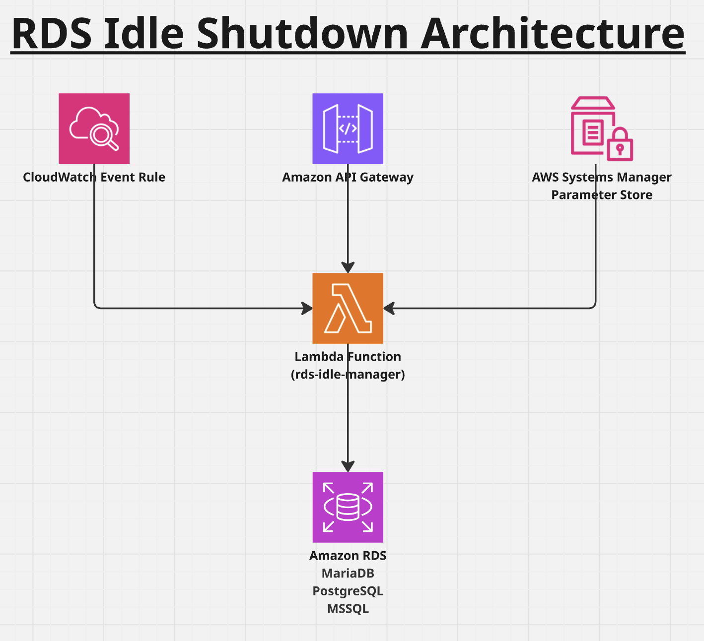

# AWS RDS Idle Shutdown with Lambda

This checklist provides step-by-step instructions to set up automatic idle shutdown for an RDS instance using AWS Lambda. 
The solution includes a Lambda function, IAM role, CloudWatch Events, and optional API Gateway integration.

---
## Architecture:



## Steps

1. **Create an IAM role for Lambda (e.g., rds-idle-manager-role):**
   - Trust policy: `lambda.amazonaws.com`
   - Permissions:  
     - `rds:StopDBInstance`  
     - `rds:StartDBInstance`  
     - `rds:DescribeDBInstances`  
     - `ssm:GetParameter`, `ssm:GetParameters`  
     - `logs:CreateLogGroup`, `logs:CreateLogStream`, `logs:PutLogEvents`

2. **Store idle timeout parameter in SSM Parameter Store:**

   ```bash
   aws ssm put-parameter --name /rds/idle_shutdown_minutes --type String --value "10"
   ```

3. **Write the Lambda function (Python 3.12/3.13):**
   - See [lambda.py](./lambda.py)
   - Use boto3 to describe DB connections.
   - If idle (no connections) for threshold minutes, stop the DB.
   - Optionally, allow manual start/stop via API Gateway trigger.

4. **Deploy the Lambda:**
   - Upload code in AWS Console or using CLI.
   - Attach IAM role created above.

5. **Set up CloudWatch Event rule:**

   ```bash
   aws events put-rule --name rds-idle-shutdown-10min --schedule-expression "rate(10 minutes)"
   ```

   - Target: the Lambda function.

6. **Verify by checking CloudWatch Logs for Lambda execution results.**

7. **Optional: API Gateway trigger for manual control:**
   - Create API Gateway HTTP API.
   - Integrate with Lambda.
   - Set route with IAM or custom authorizer.
   - Test secure start/stop calls.

---

## Notes

- Ensure your RDS instance is configured for stop/start (not Aurora Serverless v2).  
- Stopped instances still incur storage charges.  
- If using IAM authentication, update policies accordingly.  
